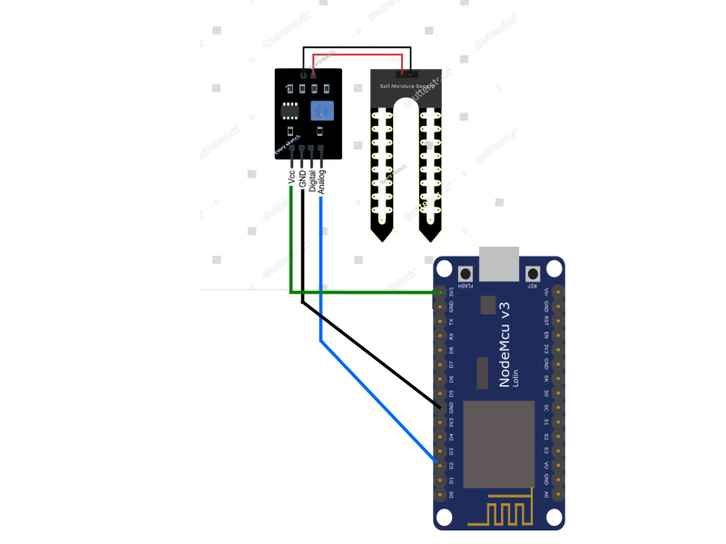

## Plant Management Monitoring with ESP8266 NodeMCU

### What it does

Reads sensor input value, analyzes if the value is below a certain threshold. If it's below threshold, then send an automated email to youremail/anyemail to notify of critical condition.

### Eqiuipments

* ESP8266 NodeMCU
* Sensor (Capacitive/Resistive soil moisture sensor in this case)
* Internet Connection (for email)
* A Demo Plant

### Circuit Diagram

### Stuff you need to edit in plantmanagement.ino

You might need to edit/change;

* The threshold value
* The Subject of the email -> line no. 35
* The wifi ssid
* Wifi password
* SMTP hostname
* SMTP port (if you're using gmail, no need to change)
* ESP8266 Sender email and password
* PIN definitions

### Future Goals for this project

A user can independently send email/commands back for a different task, needs IMAP for listening to incoming email

### Further reading

[https://samiuljoy.github.io/projects/plantmanagement.html](https://samiuljoy.github.io/projects/plantmanagement.html)
